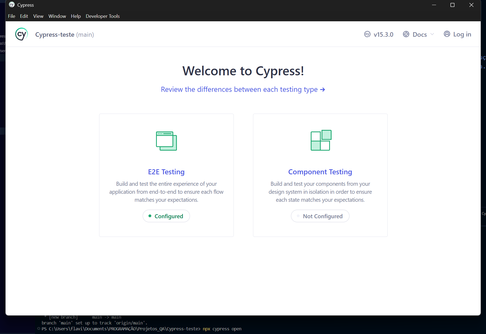
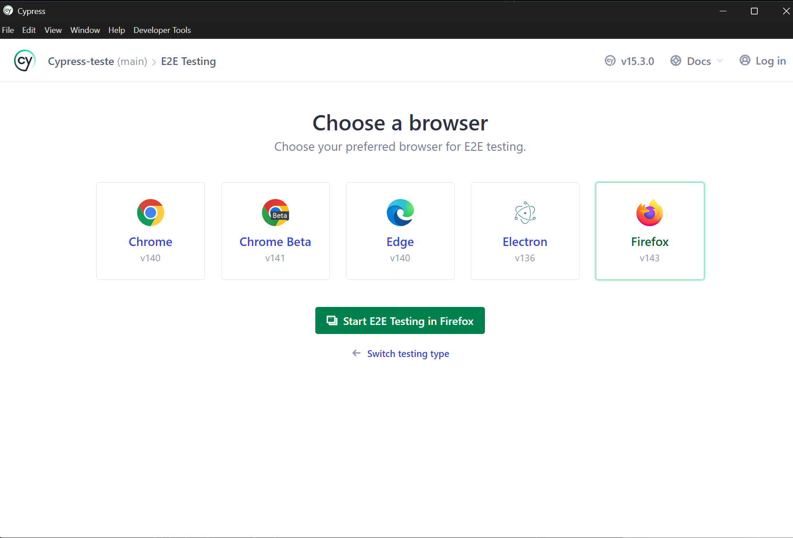
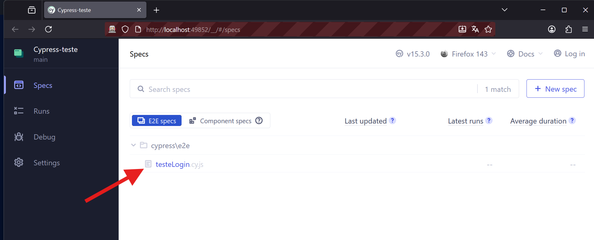
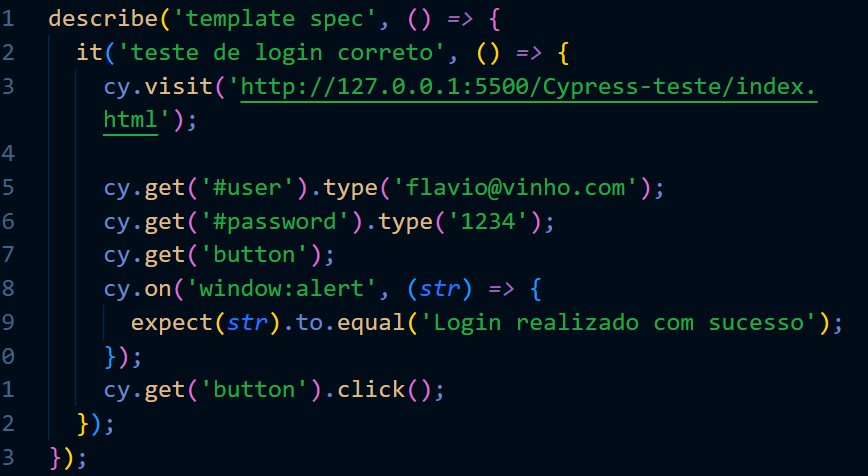
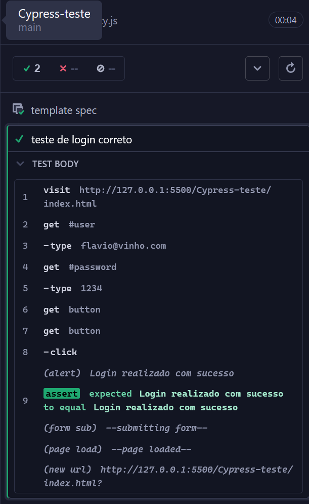
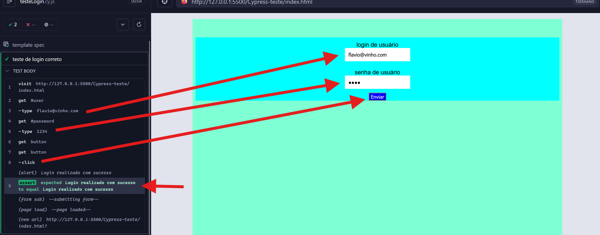

## Introdução

O **Cypress** é uma poderosa ferramenta de automação de testes end-to-end para aplicações web. Ele permite a execução de testes automatizados de forma rápida, confiável e fácil de manter, proporcionando maior confiança na qualidade do sistema.

 A realização desse projeto vista deixar evidente o entendimento do propósito do seu uso assim como realizar uma experiência "hands-on"

# Evidências de Testes Automatizados

A seguir, apresentamos um storytelling detalhado dos testes automatizados realizados com Cypress, ilustrando cada etapa com as evidências capturadas durante a execução:

---

## Storytelling dos Testes Automatizados

### 1. Abertura da Aplicação

O teste se inicia com a abertura da aplicação web, onde o Cypress acessa a URL definida no ambiente de testes. A imagem abaixo demonstra a tela inicial carregada com sucesso, comprovando que o sistema está acessível para automação.

Depois de selecionado o navegador para realização do teste. 

Em seguida, clique no nome do arquivo disponível na nova janela de navegação aberta:  

Agora, o teste será iniciado automaticamente:

---
### 2. Execução do Primeiro Cenário de Teste

No primeiro cenário, o Cypress executa comandos para preencher campos obrigatórios e acionar funcionalidades específicas do sistema. O código utilizado para esta etapa inclui comandos como `cy.get()` para localizar elementos e `cy.type()` para inserir dados. As imagens a seguir mostram o preenchimento dos campos e a validação visual dos dados inseridos.

### 3. Validação dos Resultados

Após a execução das ações, o Cypress realiza asserções para garantir que o comportamento do sistema está conforme o esperado. O print abaixo evidencia a mensagem de sucesso exibida após a submissão do formulário, comprovando que o fluxo foi concluído corretamente.

---

Essas evidências demonstram o passo a passo dos testes automatizados, desde a preparação do ambiente até a validação dos resultados, proporcionando transparência e rastreabilidade ao processo de qualidade.
Este documento destina-se ao registro de evidências dos testes realizados no sistema utilizando o Cypress.

## Comentários Finais

O uso do Cypress no processo de testes automatizados trouxe maior agilidade, repetibilidade e confiabilidade na validação das funcionalidades do sistema. Os prints acima demonstram os pontos de teste realizados e servem como evidência para acompanhamento e auditoria.
